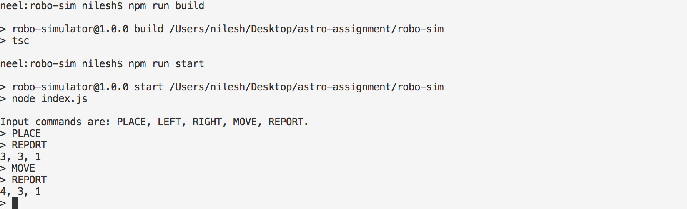

# nodejs-robo-sim

This is exercise in Typescript(compiled to Javascript). This project will demonstrate robot simulator using predefined commands. 

This is Free for re-use or practise.

Requirements Node v6 or higher
I have tested on Node v9

Now install packages & dependencies:

npm install
npm run build
npm run start or node dist/Game.js

Example: 
> PLACE 0,0,SOUTH
> REPORT
OUTPUT
> REPORT:: 0, 2, SOUTH

[COMMANDS]

PLACE X,Y,F
MOVE
LEFT
RIGHT
REPORT

[SPECIFICATIONS]

PLACE will put the robot on the table in position X,Y and facing NORTH, SOUTH, EAST
or WEST. The origin (0,0) can be considered to be the SOUTH WEST most corner.

The first valid command to the robot is a PLACE command, after that, any sequence of commands may be issued, in any order, including another PLACE command. 

The application should discard all commands in the sequence until a valid PLACE command has been executed.

MOVE will move the robot one unit forward in the direction it is currently facing.

LEFT and RIGHT will rotate the robot 90 degrees in the specified direction without changing the position of the robot.

REPORT will announce the X,Y and orientation of the robot.
