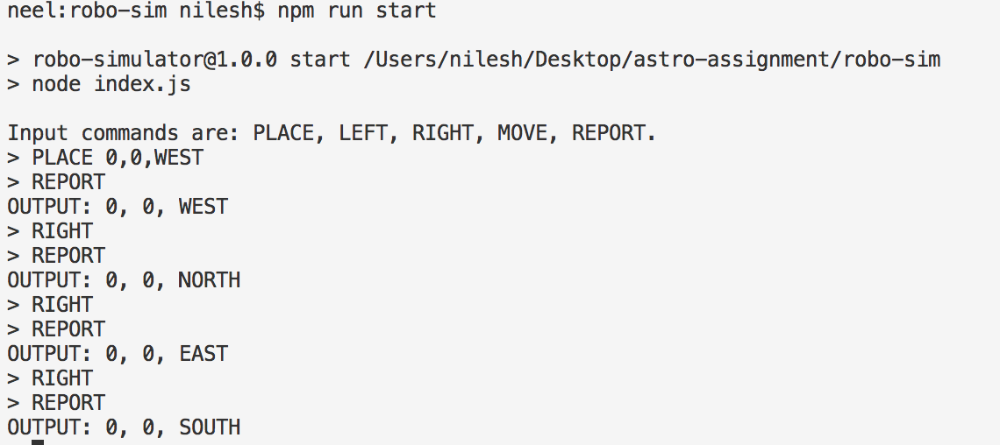

# nodejs-robo-sim

Stack: NodeJS - Typescript/Javascipt. This project will demonstrate robot simulator using predefined commands. 

[BACKGROUND]

In this assignment I will simulate a robot moving on a square table. The table is 5
units x 5 units in size. There are no obstructions on the table surface. The robot is free
to roam around the surface of the table, but must be prevented from falling.

[SPECIFICATIONS]

  PLACE will put the robot on the table in position X,Y and facing NORTH, SOUTH, EAST
  or WEST. The origin (0,0) can be considered to be the SOUTH WEST most corner.

  The first valid command to the robot is a PLACE command, after that, any sequence of commands may be issued, in any order, including another PLACE command. 

  The application should discard all commands in the sequence until a valid PLACE command has been executed.

  MOVE will move the robot one unit forward in the direction it is currently facing.

  LEFT and RIGHT will rotate the robot 90 degrees in the specified direction without changing the position of the robot.

  REPORT will announce the X,Y and orientation of the robot.


Requirements:
 Node v6 or higher I have tested on Node v9

Now install packages & dependencies:
```shell
npm install
npm run build
npm run start
```
[TESTS]

using mocha
```shell
npm test
```

[EXAMPLE]

[i]intialize by typing PLACE in console[i]

```shell
npm run start
PLACE 2,2,WEST,
 REPORT,
  LEFT,
   MOVE 
```

Example: 
Shows how robot moves


Shows Robot cannot move further than table surface


Shows How robot changes direction



